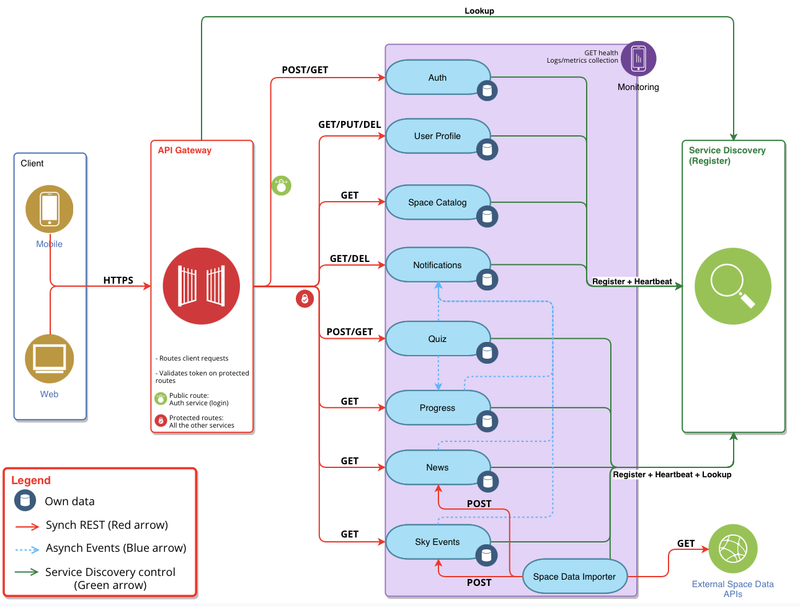
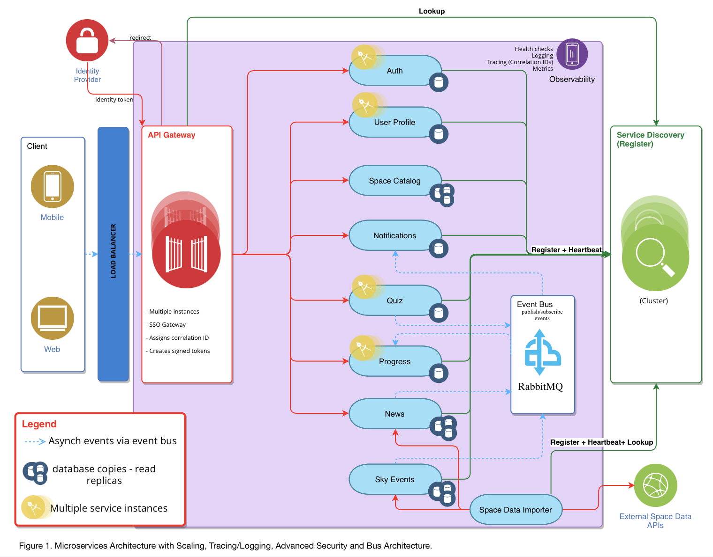

# AstroLearn — Microservices Architecture Design

This repository documents the architectural design of **AstroLearn**, an educational application that helps users learn 
about planets and space missions through content and quizzes.

> **Concept:** AstroLearn is an original application concept, designed from scratch for this 
> assignment — the educational domain, feature set, and use case are my own.

> **Note:** this is an architecture design & documentation project, not a code implementation. 
> Deliverables are architecture diagrams and supporting written reports.

## Architecture v1 — Core Cluster Design

The initial design establishes the core microservices cluster around three foundational 
patterns:

- **API Gateway** — single entry point routing client requests, validating JWT tokens on 
  protected routes
- **Service Discovery** — registry with heartbeat/lookup so services can locate each other 
  dynamically
- **Synchronous & Asynchronous REST** — synchronous calls for direct user interactions 
  (auth, quiz, profile), asynchronous internal events for background updates 
  (e.g. `QuizCompleted` → Progress, Notifications)

📄 Full write-up: [`reports/walkthrough-report-v1.pdf`](reports/walkthrough-report-v1.pdf)
📄 DevOps strategy: [`reports/devops-strategy.pdf`](reports/devops-strategy.pdf)

## Architecture v2 — Scaled, Observable & Secured

Building on v1, this iteration adds four capabilities needed for the system to scale safely:

- **Tracing & Logging** — correlation IDs propagated across every request and event, 
  centralised in an Observability component
- **Scaling** — load balancer + multiple service instances, autoscaling, and database read 
  replicas for read-heavy services
- **Advanced Security** — external Identity Provider, Single Sign-On gateway flow, and a 
  zero-trust token model validated on every internal call
- **Bus Architecture** — RabbitMQ-based event bus for publish/subscribe communication, 
  decoupling services from direct REST dependencies

📄 Full write-up: [`reports/walkthrough-report-v2-scalable.pdf`](reports/walkthrough-report-v2-scalable.pdf)

## Design Patterns Covered

- API Gateway
- Service Discovery
- Synchronous & Asynchronous REST communication
- Event-driven / Publish-Subscribe (Event Bus)
- Zero-trust security / Single Sign-On
- Horizontal scaling & autoscaling
- Database read replicas / eventual consistency

## Tools Used

- [diagrams.net (draw.io)](https://www.diagrams.net/) — architecture visualisation

> Giada Arosio — Software Engineering (AI specialisation), Torrens University Australia
